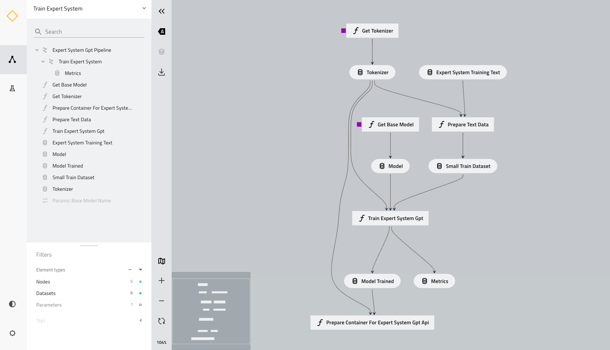

# expert-system-gpt

:notebook:

NOTE: This repository is intended for learning and research purposes. It is also worth nothing that this is a WIP and will continue to be updated.

The purpose of this project is to provide a way for any organization to leverage GPT inside their organization without having to send data externally. We also want to help democratize these foundation models so that everyone can use them in a clear transparent way without relying on a black box or a pay wall as a barrier. 

In this repository you will learn how to create your own expert system by fine-tuning and retraining a powerful open source foundation model GPT-NeoX. We will walk through the complete end to end process from the experimentation in notebooks to productionisation and finally deployment as an API or Gradio application that can be used by anyone internally in a secure fashion for any number of applications.


## Pipeline Overview 




## Experimentation Notebooks

### Model Training
[](https://colab.research.google.com/github/ShawnKyzer/expert-system-gpt/blob/main/expert-system-gpt-pipeline/notebooks/colab_expert_system_train.ipynb)

### Model Inference
[](https://colab.research.google.com/github/ShawnKyzer/expert-system-gpt/blob/main/expert-system-gpt-pipeline/notebooks/colab_expert_system_inference.ipynb)

## Getting Started
1. Download and install the latest version of Anaconda (https://docs.anaconda.com/anaconda/install/index.html)
2. Create your venv from the environment.yml file
   
    ```conda env create -f environment.yml```
3. Activate the environment
    
    ```conda activate expert-system-gpt```
4. Move into the main pipeline directory
    
    ```cd expert-system-gpt-pipeline```
5. Setup your IDE for Kedro projects
   * PyCharm or IntelliJ (https://kedro.readthedocs.io/en/stable/development/set_up_pycharm.html)
   * Visual Studio Code (https://kedro.readthedocs.io/en/stable/development/set_up_vscode.html)
5. Continue the next steps in this [README](expert-system-gpt-pipeline/README.md)

## References

* HuggingFace https://huggingface.co/
* EleutherAI https://www.eleuther.ai/
* Kedro https://kedro.org/
* BentoML https://www.bentoml.com/
